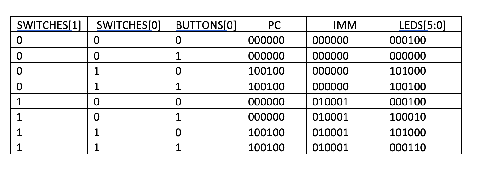

# Lab 4

Note that your files should be named what we ask and you should always have your name and date in your verilog source files. 
This is the first step in "writing your own code".
Also please remember to use good variable names. They don't need to be long, just reasonable.

# Submission Details
Today's lab will be your current files for project 1 uploaded to the repository in GitHub for your team and 
at least one commit by each team member, as well as an updated README describing the current state of the project.
The code does not have to be complete or work yet, but should represent where your team currently stands on the project.
1. File(s) uploaded to GitHub. (3 pts)
2. Updated README. (3 pts)
3. At least one commit from each team member. (4 pts - 2 each member)


# Expected Output Table


# Provided Testbench for P1

```verilog
`timescale 1 ns/ 1 ns

module top_pc_tb;
    reg b0;
    reg s0, s1;
    wire leds[5:0];
    reg test_fail;
          
    localparam time_step = 10;

    top_pc top_pc_tb(b0, s1, s0, leds[5:0]);
    
    initial
        begin
            // Need 8 test cases, for three inputs.
            // Two tests each setting of switches. 
            // Simulating a push of button 0 with switches same, models hw.

            // pushing button 0, switches 00. 
            s0 = 0;
            s1 = 0;
            b0 = 0;
            #time_step;
            test_fail = ~leds[5] && ~leds[4] && ~leds[3] && leds[2] && ~leds[1] && ~leds[0];
            if (test_fail) $display("Failed test 000");

            s0 = 0;
            s1 = 0;
            b0 = 1;
            #time_step;
            test_fail = ~leds[5] && ~leds[4] && ~leds[3] && ~leds[2] && ~leds[1] && ~leds[0];                
            if (test_fail) $display("Failed test 001");

            s0 = 0;
            s1 = 0;
            b0 = 0;
            #time_step;
            

            // pushing button 0, switches 01. 
            s0 = 1;
            s1 = 0;
            b0 = 0;
            #time_step;
            test_fail = leds[5] && ~leds[4] && leds[3] && ~leds[2] && ~leds[1] && ~leds[0];
            if (test_fail) $display("Failed test 100");

            s0 = 1;
            s1 = 0;
            b0 = 1;
            #time_step;                
            test_fail = leds[5] && ~leds[4] && ~leds[3] && leds[2] && ~leds[1] && ~leds[0];
            if (test_fail) $display("Failed test 101");

            s0 = 1;
            s1 = 0;
            b0 = 0;
            #time_step;

            // pushing button 0, switches 10. 
            s0 = 0;
            s1 = 1;
            b0 = 0;
            #time_step;
            test_fail = ~leds[5] && ~leds[4] && ~leds[3] && leds[2] && ~leds[1] && ~leds[0];
            if (test_fail) $display("Failed test 010");

            s0 = 0;
            s1 = 1;
            b0 = 1;
            #time_step;                
            test_fail = leds[5] && ~leds[4] && ~leds[3] && ~leds[2] && leds[1] && ~leds[0];
            if (test_fail) $display("Failed test 011");

            s0 = 0;
            s1 = 1;
            b0 = 0;
            #time_step;

            // pushing button 0, switches 11. 
            s0 = 1;
            s1 = 1;
            b0 = 0;
            #time_step;
            test_fail = leds[5] && ~leds[4] && leds[3] && ~leds[2] && ~leds[1] && ~leds[0];
            if (test_fail) $display("Failed test 110");

            s0 = 1;
            s1 = 1;
            b0 = 1;
            #time_step;                
            test_fail = ~leds[5] && ~leds[4] && ~leds[3] && leds[2] && leds[1] && ~leds[0];
            if (test_fail) $display("Failed test 111");

            s0 = 1;
            s1 = 1;
            b0 = 0;
            #time_step;
            $display("End top-pc.v tests.\n");
            $finish();
        end
    
endmodule

```
