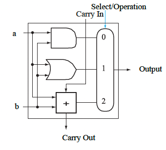
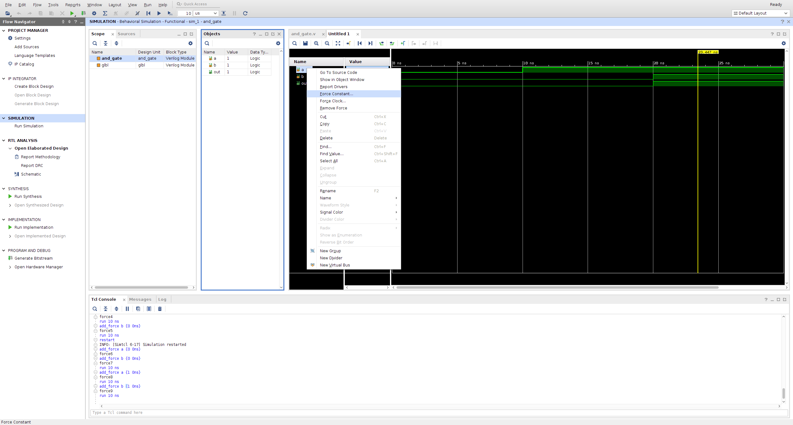

# Lab05 One-bit ALU
Today you will start a new project that will be the one-bit alu as shown in the diagram below.

## Detailed specifications
The goal is to implement the one-bit alu shown by using your previously designed adder 
(represented by the square with the +) in a file called `top_lab05.v`. 
This top file should create the circuit shown above using the following inputs so 
that it can be programmed on the board fpga.

Instead of the signal in the diagram shown on the left, use the board name on the right.
a: SWITCHES[0]
b: SWITCHES[1]
Carry In: BUTTONS[1]
Select/Operation: BUTTONS[0]
Output: LEDS[0]
Carry Out: LEDS[1]

Note that you may use busses for the input and/or output as you see fit. 
Once you have created your circuit, you should create a testbench and simulate.
Then program the board and experiment with the design, making sure it works on the board.

## Submission
You should submit a pdf that includes:
1. Your full names.
2. Your top_lab05.v code.
3. Your test bench code.
4. A screen capture of the schematic from your top_lab05.v
5. A screen capture of the timing diagram from running your testbench.
6. A picture of one example of your board, with the switches, leds, and buttons visible
   of the circuit with the correct output on the board.

## Some reminders about creating the project
### Adding sources
Make sure to use the Vivado IDE to add sources and make sure you have categorized them appropriately as source files (verilog with the actual hardware design), simulation sources (testbenches), or constraints files.

### Selecting the right part
Select the `Board` tab. Under `Name` find PYNQ-Z1.
Select PYNQ-Z1 in table below. Make sure that the Part is xc7z020clg400-1 or it may cause problems later.

    5. Force a constant value on an input line (signal)

    1) Select the signal -> right click -> force constant -> force value -> 1
   
   

   

   # Setting up a constraints file

Download the constraints file at https://github.com/cs456s24/cs456s24/tree/main/lab2 
