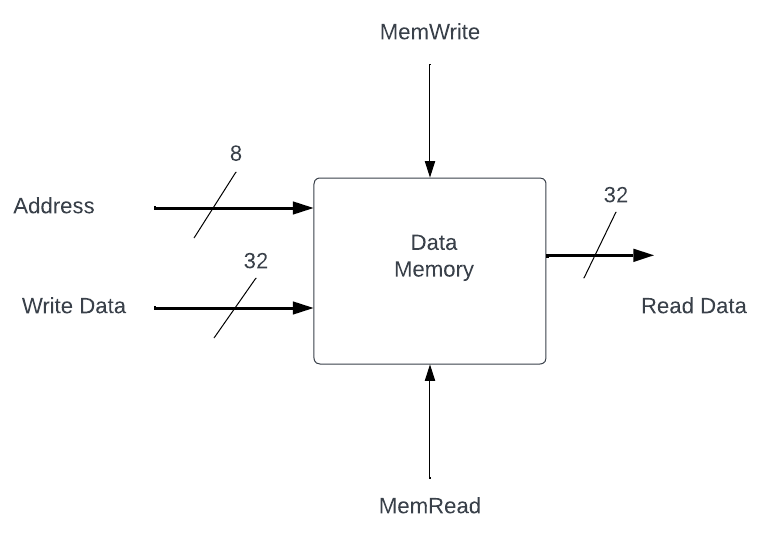

# Lab09 Synchronous RAM
Similar to the asynchronous ROM that you designed before break, RAM is a memory block accessed by
supplying an address to the RAM. In the case of RAM though, the data can either be written or read.
This data can be accessed by supplying an address to the RAM; after some time, the RAM will output the 
data stored at that address.  A memory block, in general, can contain as many addresses in which to 
store data as you desire.  Every address should contain the same amount of data (bits). The number of 
addresses is called the depth of the memory, while the number of bits stored per address is called the 
width of the memory.

The assignment today is to create a synchronous RAM that changes values on the falling edge of a clock.
Note that the circuit shown below is the same as the data memory in the single-cycle processor, and so
will be of use in your next project, P3.

## Submission
Submit a pdf with the following: 
1) the verilog module for your synchronous RAM
2) the testbench you are using to create a timing diagram
3) schematic for your synchronous RAM
4) a timing diagram for a read, write, read to the RAM, showing the correct output

## A Data Memory Circuit Design



## A Data Memory Verilog Module
Note that a RAM is most easily organized as a two-dimensional net to make indexing easier. 

Syntax: `reg [M:0] <netname> [N:0]`

The above creates a net called <netname> and describes it as an array of (N+1) elements, where 
each element is a (M+1) bit number.

Example: 
`reg [31:0] ram [255:0];`  // A memory structure that has 256 32-bit elements.
`ram[2]` // The full 3rd 32-bit element
`ram[5][7:0]` // The lowest byte of the 6th 32-bit element

```verilog
module ram (input clk, input [:0] address, output reg [31:0] data); 

endmodule
```
